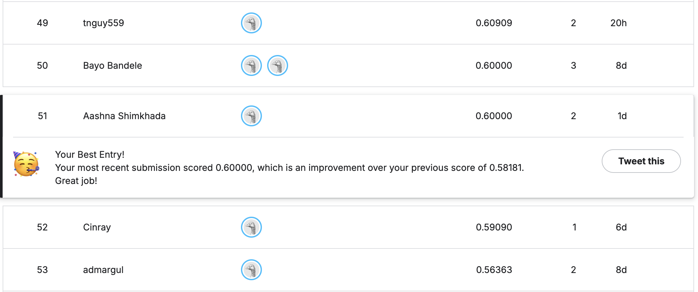

# **CSE 144 – Transfer Learning Challenge (Spring 2026\)**

**UC Santa Cruz | CSE 144 Applied Machine Learning**  
 **Kaggle:** [UCSC CSE 144 Spring 2026 Final Project](https://www.kaggle.com/competitions/ucsc-cse-144-spring-2026-final-project)

## **Author**

| Aashna Shimkhada | CruzID: aashimkh |
| :---- | :---- |

## **Kaggle Leaderboard**

*Public leaderboard score: **60%***

## **Approach Summary**

EfficientNet-B3 (ImageNet pretrained, \~12M params) fine-tuned in two phases with differential learning rates and gradual backbone unfreezing. Developed through four experimental iterations diagnosing overfitting, underfitting, and an inference bug.

| Run | Val Acc | Issue |
| ----- | ----- | ----- |
| v1 (CPU, 40 ep) | \~60% train gap | Severe overfitting (train→100%) |
| v2 (CPU, 15 ep) | \~42% | Over-regularized, not converged |
| v3 (GPU, 35 ep) | \~57% | Truncated early |
| **v4 (GPU, 50 ep)** | **\~61% ✓** | Converged, above baseline |

**Key bug fixed:** `TestDataset` returned `p.stem` (`"42"`) but `sample_submission.csv` uses `"42.jpg"` — the `.map()` silently produced all-NaN labels. Fixed to `p.name`.

---

## **Repository Structure**

cse144-transfer-learning/  
├── cse144\_transfer\_learning.ipynb  \# Full training \+ inference notebook  
├── CSE144\_Final\_Report.pdf         \# Project report  
├── submission.csv                  \# Final Kaggle submission  
├── presentation.pdf             \# Final Presentation  
├── leaderboard\_screenshot.png      \# Kaggle leaderboard position  
└── README.md

**Model weights** (too large for git):  
 [Download best\_model.pth from Google Drive](https://drive.google.com/file/d/1vAPTgvQMxq_NdM3mTmcEeS3ZVFJTcpBd/view?usp=sharing)

---

## **Setup**

Open `cse144_transfer_learning.ipynb` in **Google Colab**.  
 Set runtime: **Runtime → Change runtime type → T4 GPU**

Place your dataset in Google Drive at `My Drive/data/` with this structure:

data/  
├── train/  
│&emsp;├── 0/   (10 images)  
│&emsp;├── 1/  
│&emsp;└── ... 99/  
├── test/  
│&emsp;├── 0.jpg ... 999.jpg  
└── sample_submission.csv  

## **Training**

Run all cells (**Runtime → Run all**). The notebook will:

1. Mount Drive and copy data to local SSD (faster I/O)  
2. Zero-pad folder names (`"0"` → `"00"`) and verify label ordering  
3. **Phase 1** (10 epochs, LR=3e-3): Train classifier head only, backbone frozen  
4. **Phase 2** (≤40 epochs, early stop patience=12): Differential LRs — backbone 1e-4, head 1e-3; unfreeze top 4 blocks at start, top 6 at epoch 11  
5. Save best checkpoint to `best_model.pth` and the local Colab files

Expected runtime: **\~18–20 minutes** on T4 GPU.

---

## **Inference (Generating submission.csv)**

Handled automatically by cell 12 (TTA) and cell 13 (save \+ download). To regenerate from a saved checkpoint:

python  
\# In Colab, run cells 1-5 (setup), then cell 12 (TTA inference)  
\# Requires best\_model.pth in working directory

Three TTA views are averaged: original, center-crop, horizontal flip.

---

## **Reproducing Results**

| Setting | Value |
| ----- | ----- |
| Random seed | 42 |
| Backbone | EfficientNet-B3 (ImageNet DEFAULT) |
| Image size | 224 × 224 |
| Batch size | 32 |
| Phase 1: epochs / LR | 10 / 3e-3 |
| Phase 2: backbone LR / head LR | 1e-4 / 1e-3 |
| Scheduler | CosineAnnealingWarmRestarts (T₀=10) |
| Weight decay | 1e-4 |
| Mixup α (Phase 2\) | 0.4 |
| Label smoothing | 0.1 |
| Early stop patience | 12 |

With the same seed and T4 GPU, val accuracy reproduces within ±1%.
